# ISAD note
课上讲的重点内容我会标记 (Important)

赶时间的话可以只看 Important 部分

# lec 1

## 1 互联网时代的软件系统

### 1.1 互联网时代软件特点
- 业务与信息紧密融合
- 规模大、并发行高
- 周期短、更新快
- 开放、普适环境

### 1.2 互联网时代的软件挑战
- 个性化的软件**需求**
- 柔性可变的软件**形态**
- 快速敏捷的软件开发**过程**
- 普适移动的软件开发、应用**环境**

## 2 互联网时代软件工程思想
- 软件**需求**
- 软件**形态**
- 开发**过程**
- 软件**验证**

### 2.1 覆盖全生命周期动态获取软件需求
- 需求主体
    - 主体不固定
- 需求获取
    - 动态获取
- 需求满足
    - 从一次性交付转变为持续优化

### 2.2 基于流程的网络服务动态集成交互（形态）
- 软件构件
    - 从功能构件构造，转变为以业务为核心的多功能处理流程
- 组装方式
    - 从功能组装集成，转换为多个服务交互实现动态组合
    - e.g. 微服务
- 运行环境
    - 从静态预设，转变为面向情景感知的自适应

### 2.3 敏捷、增量迭代的开发过程
- 过程推进
    - 阶段循序渐进开发，到各阶段边界模糊的敏捷模式
- 开发方式
    - 整体提交，到不断迭代增量开发
- 团队协作
    - 注重接口的分工合作方式，到各团队界限模糊的协同融入

### 2.4 用户体验为中心的软件验证演进
- 验证目标
    - 以功能满足为核心，转变为以用户体验为核心
- 验证方式
    - 上线的全面测试，转变为上线运行后渐进优化
- 验证内容
    - 代码的需求覆盖性测试，转变为数据挖掘分析后的模型一致性验证

## (Important) 3 互联网时代的软件工程方法框架

- 过程维度
    - 覆盖全生命周期的持续优化框架
- 形态维度
    - 微服务与容器的结合
- 管理维度
    - Scrum + DevOps

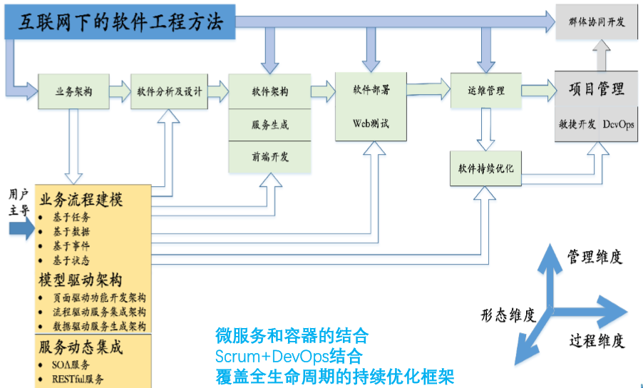

### 3.1 模型驱动的全生命周期业务建模及转换（过程维）
- 业务建模
    - 功能建模、数据建模是起点
    - 业务流程建模主流
    - 基于数据的视角
    - **业务建模**以及**模型转换**时互联网环境下软件需求描述和实现的主要方式

####（1）业务建模
- 结构建模过程
    - 用例分析，建立**用例模型** （Use Case）
    - 包图、类图、协作图等建立**业务逻辑结构**模型
    - 页面间的**跳转逻辑**分析
- 行为建模过程
    - 有限状态机对 Web 应用自顶向下划分，形成不同层次
    - 不同层面上的服务器端组件，进行依赖关系描述
- 业务建模上，传统软件系统开发存在如下困难
    - 从应用逻辑分离出流程逻辑很难
    - 业务流程需求模型的变化难以描述
    - 业务需求和软件实现之间的关联性难以建立

####（2）模型驱动体系结构（MDA）
- 基本原理是**提高抽象**的层次，以**模型驱动**方式在一个抽象层次来设计软件
- e.g. 
    - 计算无关模型 CIM 
    - 平台无关模型 PIM
    - 平台相关模型 PSM

### 3.2 基于 Web 服务的软件动态构造（形态维）
- 面向服务架构 SOA 以业务为导向
- Web 服务快速发展的原因
    - 采用广泛部署的**通信协议**，分布系统间易于通信、互操作
    - 基于文档的**消息模型**，不同类型应用间松耦合
    - 在支持互操作性的**开发标准**基础上的应用解决方案

####（1）服务组合
协调若干 Web 服务共同工作满足业务需求。
- Example
    - SpringCloud
- 难点
    - 缺乏实现**服务语义描述**的有效机制
    - 缺少高效、灵活的**服务匹配**方法
    - 缺少大规模的**自动服务组合**方法
    - Web **服务行为建模**理论薄弱

####（2）轻量级 Mashup
- **轻量级**服务组合方法，**共享已有组件**
- Example
    - 直接使用第三方 API

####（3）最终用户软件开发
- End-User Development：一组方法，技术和工具，使非专业软件开发人员用户，也可以在软件系统中，创建、修改、拓展软件的组件
- 流行的原因
    - 缩短项目完成时间
    - 软件开发工具功能更强大，易于使用

### 敏捷化的软件项目开发及运维（管理维）
- 敏捷软件开发缩小需求与开发之间的隔阂
- 敏捷软件运维模式DevOps缩小了开发与运营之间的隔阂

####（1）敏捷软件开发与Scrum
- 以人为本
- 保证质量的前提下，适度文档，适度度量
- Scrum四个主要工件
    - 产品待办事项列表
    - Sprint代办事项列表
    - 燃尽图
    - Scrum每日例会
####（2）软件运维与DevOps
- 持续集成与发布
    - SVN，Jenkins，Maven，Drone
- 自动部署
    - Puppet，Ansible，Chef，Saltstack
- 监控
    - Zabbix，Nagios，Prometheus
- 日志分析
    - Zipkin，EFK

## 4 小结
- 互联网时代软件的 特点 与 挑战
- 需求、形态、过程、验证
- 过程维度、形态维度、管理维度

# lec 2

## （Important）1 软件三种开发模式
- 定制开发
- 套件实施
- 模型驱动架构

### 1.1 基于定制开发模式的软件构造
- 含有**高事务量**或者具有**特殊业务需求**的系统
- 优势
    - 外包开发，运维服务
- 劣势
    - 人员多
    - 周期长
    - 成本高

### 1.2 基于套件实施模式的软件系统实施
- 基于一些平台，通过业务模型导引下的数据和功能配置，搭建可用系统的过程、

#### 业务蓝图 （业务参考模型）
- 描述企业业务的四个方面
    - 事件
    - 功能（任务）
    - 组织
    - 交互

- 流线式的过程描述

- 优势
    - 周期短
    - 成本低
    - 质量稳定
- 劣势
    - 受软件已有功能和架构的限制，部分特别需求难以满足

### 1.3 业务模型驱动的软件架构模式
- 构建业务模型的基础上，通过模型驱动的转换，实现软件架构，进而构造出可运行的软件
- 改善整体业务，易于调整适应业务变化

## 2 软件架构的演化

### 2.1 架构
- 单机系统
- 数据库系统
- 三层架构 C/S, B/S 加数据库
- 工作流系统
- 多层架构
- 云架构

### 2.2 MVC 模式的互联网架构

- 经典多层 

### （Important）2.3 以业务为中心的微服务架构
- 一种架构风格
    - 将大型的复杂业务分为多个微服务
    - 松耦合，可被独立部署
    - 服务计算的一种优化实现方式
- 特性
    - 基于服务的应用组件化
    - 围绕业务能力组织微服务
    - 按产品而非项目划分微服务
    - 强调智能端点和管道扁平化
    - 分散式管理
    - 分散式数据
    - 基础设施自动化
    - 基于故障的设计
    - 演进的设计
-----------------------
| 单体架构 | 微服务架构 |
|---------|-----------|
| 整体部署  | 拆分部署 |
| 紧耦合  | 松耦合 |
| 基于整个系统的扩展 | 基于独立服务，按需扩展 |
| 集中式管理 | 分布式管理 |
| 应用无依赖关系管理 | 微服务间较强的依赖关系管理 |
| 局部修改，整体更新 | 局部修改，局部更新 |
| 故障全局性 | 故障隔离，非全局 |
| 代码不易理解，难维护 | 代码易于理解维护 |
| 开发效率低 | 开发效率高 |
| 资源利用率低 | 资源利用率高 |
| 重，慢 | 轻，快 |

#### 微服务架构的问题
- 开发人员技能要求高 
- 接口的数目和匹配问题 
- 分布式系统复杂性 
- 可测性的挑战 
- 异步机制 
- 代码重复 
- 运维开销及成本增加

因此只有当系统复杂度持续增加，业务对技术的支撑需求和预期加强时，考虑微服务才是合理的。

## 3 面向互联网的软件过程
- 互联网环境下的软件过程：
    - 覆盖全生命周期的 持续集成框架
- 从用户出发
    - 基于用户应用流程的逐步推演过程

### 3.1 (Important)基于流程的软件系统实施过程
围绕业务流程生命周期的模型构建与转换，也是基于业务流程的管理活动，也提供了软件实施步骤和任务划分的基础。

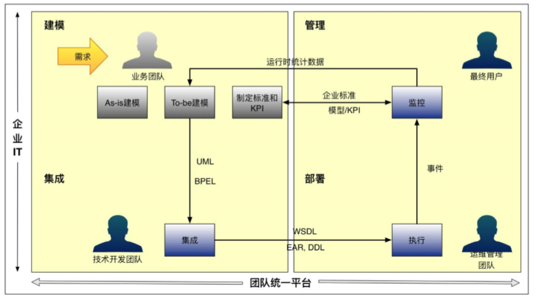

- 基于 WebSphere 套件支持业务流程的管理
- 四个主要组件对应四个阶段
    - 建模
        - 使用 WebSphere Business Modeler 收集需求，设计，建模，仿真，优化业务模型
    - 装配
        - 在建模基础之上，采用 WebSphere Integration Developer 建立模型和组件、资源的映射关联，实现系统配置
    - 部署
        - 采用 WebSphere Process Server 对所有基于 SOA 的流程自动化
    - 管理
        - 采用 WebSphere Business Monitor 实现流程运行的动态管理
### 3.3 软件开发相关角色及职责
- 开发相关
    - 业务类
        - 业务咨询师
    - 开发类
        - 系统架构师
        - 系统开发人员
        - 系统测试人员
    - 运维类
        - 系统运维人员
- 管理类
    - 项目经理
    - 产品经理

## 4 小结
- 软件开发模式的定制开发-套件实施-模型驱动架构 比较分析；
- 阐述了软件架构的演化历程，结合互联网环境阐述 了经典多层架构的内容，以及微服务架构的主要特点；
- 阐述了基于流程的软件开发实施过程，相关的工具支撑，以及相关主要角色的职责和任务。

# lec 3

## 1 面向复杂软件构造的业务模型
- 软件系统与业务模型密不可分
    - 宏观：软件系统的建立就是计算机信息模型的建立过程
    - 微观：软件系统本质是由一系列相关模型构成的有序集合
- 软件的前提
    - 企业业务状态进行建模与分析
    - 复杂软件构造需要以模型描述并分析企业的业务问题，业务模型是分析、设计、实施复杂软件系统的重要步骤

### 1.1 业务建模概述
- 定义：对于企业业务的某些方面进行的描述
- 标准而规范的描述手段

### 1.2 业务模型分类
多层次，多视角，复杂关联，时序相关。

不同角度不同分类。

- 表示形式
    - 可视化模型
    - 形式化模型
- 抽象程度
    - 概念模型
    - 逻辑模型
    - 物理模型
- 内容角度
    - 功能模型
    - 信息模型
    - 数据模型
    - 控制模型
    - 决策模型
- 架构角度
    - 表现模型
    - 逻辑模型
    - 数据模型
    - 存储模型

### 1.3 （Important）业务建模与软件建模
- 业务模型到软件系统的映射
    - 理想：业务模型中的对象可以映射为软件系统的对象
    - 实际并不是

- 业务模型与软件模型
    - 业务建模与软件建模处于生命周期的不同阶段
    - 业务模型可以转变为相应的软件系统模型， 
    - 软件系统和业务系统之间存在许多相似之处，也存在一些差异
    - 业务建模中的常用概念和标准的系统建模是不一样的
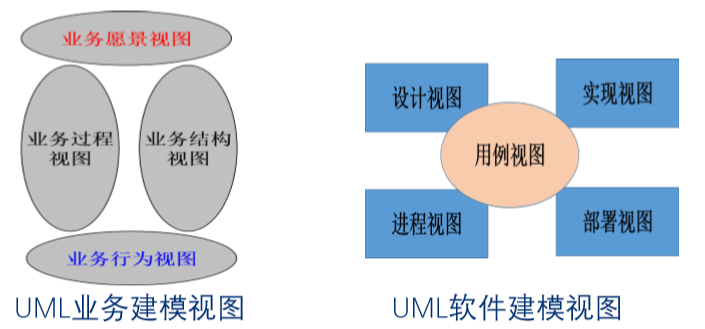

- 区别
----------------------------
| 模型 | 业务模型 | 软件模型 |
|------|---------|----------|
| 目的 | 面向企业业务分析 | 面向软件系统开发 |
| 领域 | 业务层面 | 技术层面 |
| 模型层次 | 较高：组织、业务概念、流程等 | 较低：数据类、函数、表字段、进程等 |
| 支持框架 | ARIS、Zachman、UML 业务建模框架 | SSH、RUP |

## 2 业务架构方法
- 企业架构包括
    - 业务架构
    - 信息架构
    - 技术架构

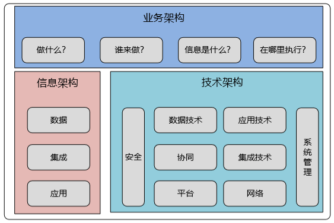

### 业务架构要素
- 信息对象
- 过程
- 组织
- 功能
- 目标
- 规则

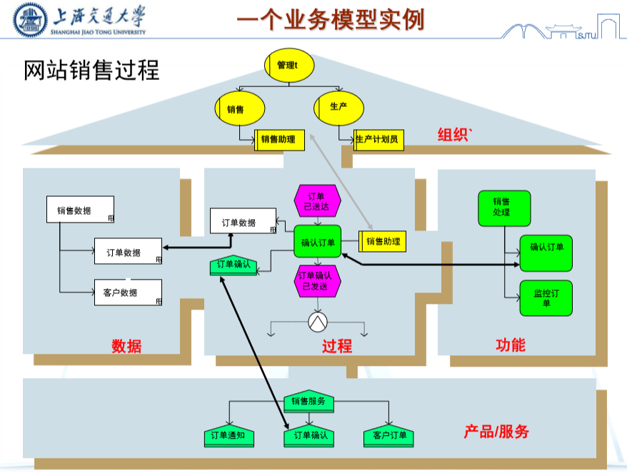

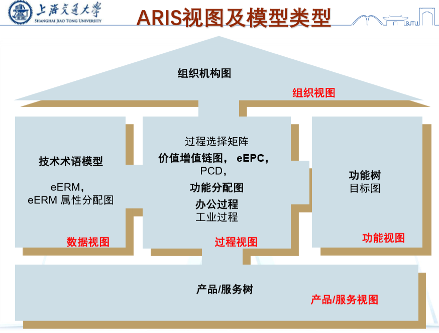

### 三个层次
- 视图
    - e.g. 业务流程视图
- 模型图
    - e.g. 每个业务流程都有的单独模型图
- 业务对象及关联
    - e.g. 图里面的 instance 和连线

## 2.2 业务架构原则
- 特点
    - 多视角
    - 多层次
    - 复杂相关
    - 时序依赖
- 原则
    - 描述建模方法：
        - 分离
        - 分层
        - 分解
        - 一致性
    - 描述实现的目标：
        - 模块化
        - 通用性
    - 描述容易出现的问题
        - 功能与行为分离： 可以控制复杂性
        - 活动与资源解耦： 体现系统柔性

## 2.3 业务建模方法及发展
- 基于功能
- 基于流程
    - 集成化建模（多视图建模）
- 基于服务
- 基于大数据

### （1）基于功能的建模方法
- SADT（结构化分析与设计方法）和IDEF（功能分解法）
- 缺乏丰富的语言描述能力
- 交流障碍，姓曾自动化孤岛

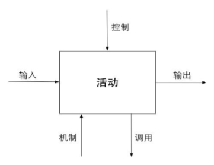

###  (2) 基于过程的建模方法
- 过程定义为一组活动的偏序集，过程与子过程形成递阶关系
- 活动间有一定顺序，活动的执行可能需要出发条件
- 还可以进一步按照基本要素划分
    - 基于数据的业务流程建模
        - 数据流图
    - 基于活动的业务流程建模
        - 活动图
    - 基于事件的业务流程建模
        - EPC
    - 基于状态的业务流程建模
        - PetriNet
---------------------------------------
| 方法 | 主要组件 | 连接方式 | 主要代表模型 |
|------|---------|---------|------------|
| 基于数据的业务流程建模 | 数据实体 | 数据活动 | 数据流 | 数据流图 |
| 基于活动的业务流程建模 | 时序活动 | 系列流 | 活动图 |
| 基于事件的业务流程建模 | 功能活动 | 事件 | 事件流 | EPC |
| 基于状态的业务流程建模 | 系统状态 | 状态转移事件 | 状态变迁 | PetriNet |

#### 多视图业务建模方法
- 以过程模型为核心
    - 工作流模型
- 其他视图模型为辅助
    - 功能视图
    - 信息视图
    - 组织视图
    - 资源视图

### （3）面向服务的建模方法
- 通过处理，前面的方法都可以面向服务开展业务转换，构造出标准 SOA 服务或者 RESTful 服务
- SOAP & REST
- 基于功能接口
- 或 基于 URI 资源

### （4）面向大数据的业务建模方法
- 多维度综合分析
- e.g.
    - 基于用户画像的购买行为分析模型
    - 基于地理位置聚类的店铺竞争分析模型

## 3 典型业务模型
- 企业业务模型是一组具有特定目的的互补模型集合，这些特定模型描述了企业某些用户特定需求的不同侧面
- 简单的业务建模框架（信息建模矩阵）

-----------------------------
|  | 流程 | 功能 | 业务对象/信息 | 组织/任务 |
|--|----|------|-------------|-----------|
| 流程 | 流程模型 |  | 状态转换图 |  |
| 功能 | 流程图 | 功能模型 |  | 组织权限图 |
| 信息 | 顺序图 | 数据流图 | 信息模型 |  |
| 组织 |  | 用例图 | 协作图 | 组织模型 |

1. Zachman Framework
2. CIM-OSA Method
3. ARIS
4. PERA
5. Dynamic Enterprise Modeling

### 3.1 Zachman 框架
六个描述的视图
六个角色的角度

- 评价
    - 没有给出构架的详细步骤或过程方式
    - 缺乏必要的分析仿真方法
    - 不能描述企业的复杂性

### 3.2 CIM-OSA 框架

由生命周期维、视图维和通用维组成的三维模型

对企业行为和功能进行递阶分解

- 评价
    - 与其他 CIM 体系相比，具有全面性、完整性、开放性、标准化和形式化等优点
    - 没有一种真正意义上的方法论知道建模过程的实施
    - 模型框架的部分内容尚不完善
    - 过于强调形式化
    - 使一般用户难以理解和掌握

### （Important）3.3 ARIS 框架
- 4+1 视图
    - 功能视图
    - 数据视图
    - 组织视图
    - 控制视图
- 5 个截断
    - 现行系统分析
    - 需求定义
    - 设计说明
    - 实施描述
    - 运行维护
- 特点
    - 覆盖业务问题解决的生命周期
    - 以过程为核心的集成
    - 面向对象的模型构建及关联
- 评价
    - 基于过程的模型结构，描述了企业的组织视图、数据视图、过程视图和功能视图，四者相互关联形成一个企业系统
    - 希望提出一个整合性的理念，把描述企业程序的所有基本观念统统纳入。依据不同观念切割复杂模型，只专注观念内的事物，之后整合个观念的模型成完整分析，不会有任何重复。

### 3.4 PERA
- 将任务视为最底层
- 功能视图
- 实施视图
- 评价
    - 最完整的生命周期
    - 非形式化，易于理解
    - 可执行性非常差
    - 缺乏数学建模技术
    - 不能仿真优化

### （Important）各框架比较
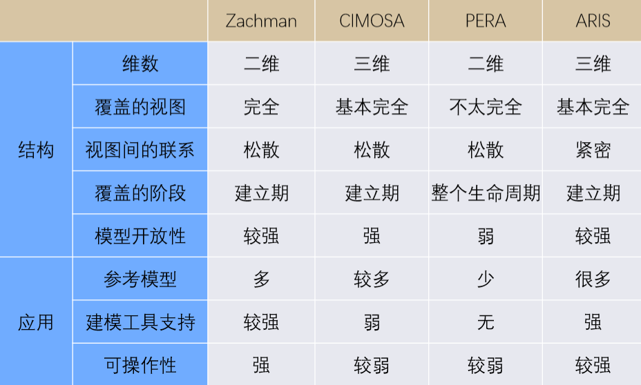

### 3.5 DEM 动态企业建模方法
- DEM 提出的原因
    - ERP 实施中的问题
        - ERP 复杂，不灵活，费用高，周期长，成功率低
        - 维护困难
        - 模型僵化，无法满足新的业务需求
- 特点
    - 预定义模型框架可支持重用
    - 模型课自动转化成应用
    - 模型结构可动态调整
- 以业务过程模型为驱动
- 建立动态可连续变化的框架结构

## 4 小结
- 业务模型的作用及意义
- 对比业务模型和软件模型
- 业务架构的方法与内容，业务建模方法
- 典型的企业建模框架和业务模型的基础方法

# lec 4
## (Important) 1 基于任务的过程建模方法
- 基于功能结构划分，面向执行的活动系列以及控制逻辑描述
- 功能分解图
- 基于时序的活动描述
- 角色行为图
- 任务划分

### （1）功能分解图
- 从顶向下
- 高内聚低耦合

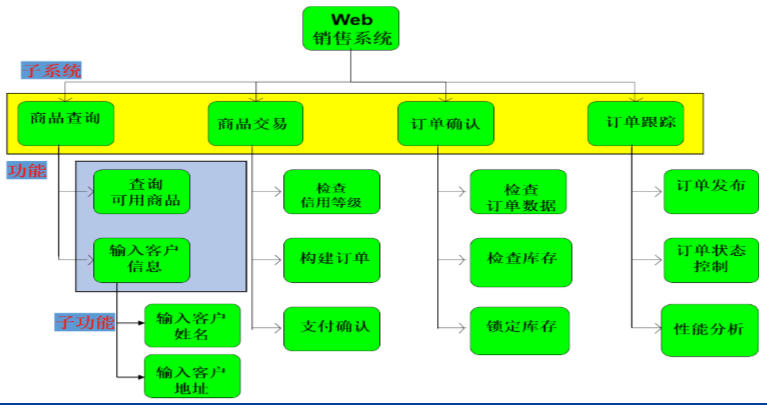

- 如何划分任务，是功能任务分解的主要问题
- 任务分解方法
    - 根据角色活动进行划分
- 软件系统划分还有
    - 根据信息对象划分
    - 根据操作的任务划分
    - 根据流程的任务划分

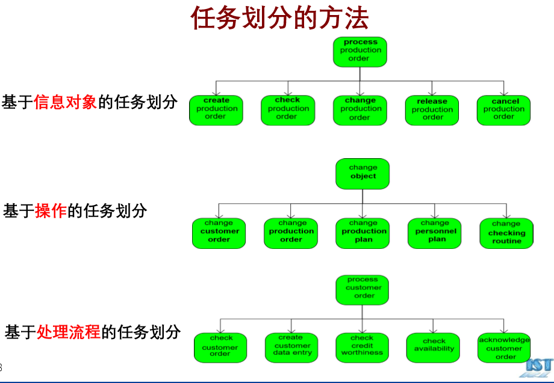

### （2） 基于聚类的任务划分
- 从相关业务要素的关系进行划分
- UC矩阵
- 主要过程
    - 任务相关性矩阵
    - 构造聚类谱系图
    - 分解演化相关任务，重新建立任务关系

### （3）基于时序的活动描述
- 描述对象活动的顺序关系
- 带泳道的活动图
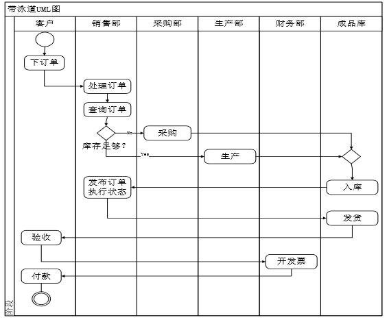

### （4）角色行为图
不需要画，但是要看懂

- 基本概念
    - 角色
    - 目标
    - 活动
    - 角色间交互作用
    - 经营规则

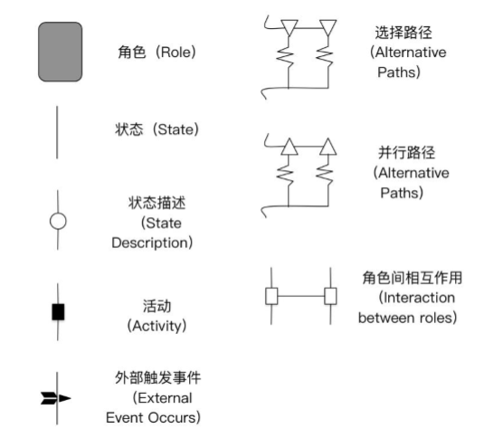
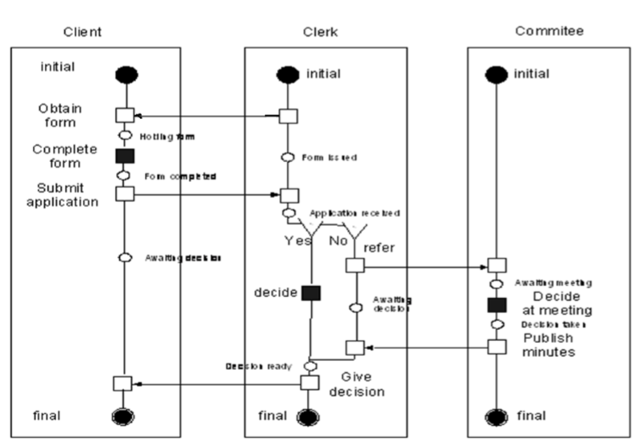
- 特点
    - 按角色分解流程
    - 基于角色状态描述的流程目标
    - 按时序执行活动
    - 关注角色的交互作用而不是形式
    - 体现企业的经营规则

### 1.2 人物的执行限制
- 有限状态机
- 有限个状态以及在这些状态之间的转移和动作等行为的数学模型
- 状态： 反映从系统某一时刻的条件
- 转移：只是状态的变更，用转移发生的必须条件来描述
- 动作：给定时刻要执行活动的描述

### 有限状态机符号
- 状态图描述了一个信息实体对于事件反应的动态行为
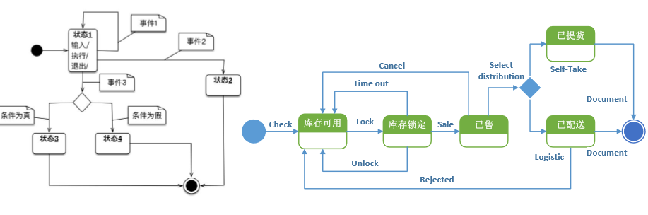
- 状态转移表：描述资源状态变化的另一种方式
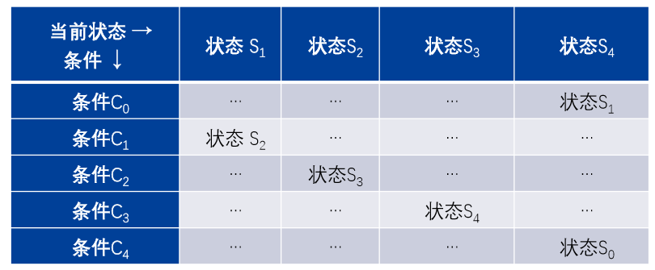

## (Important) 2 基于数据的过程建模方法

- 数据分类
    - 基础数据（主数据）
        - 主要是相对稳定、可以在公共范围内重用的基础数据，可独立存储并单独存在，主要的操作可以分为只读不写，以及单独的增删权限等。 
    - 业务数据
        - 是大量生产及重复处理的业务数据
    - 状态数据
        - 面向流程类应用的信息控制所建立的数据， 主要体现为主数据或者事务数据的动态状态变化
    - 关联数据
        - 连接业务数据和主数据的中间数据，和数据处理过程相关
    - Example
        - 主数据：司机、员工、班车
        - 业务数据：班车路线
        - 关联数据：路线的站点、班车日程安排
        - 状态数据：一趟班车上有哪些员工、司机
- ER图

## 2.1 数据流描述
### DFD 数据流图
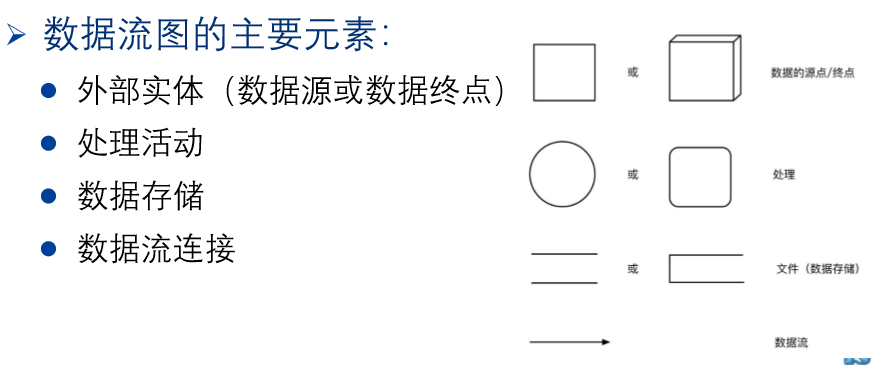
- 原则
    - 以外部实体开始，以外部实体结束
    - 外部实体间不应该存在数据流
    - 保持数据守恒
    - 每个活动既有输入数据流，又有输出数据流
- 分层 DFD
    - 顶层DFD只含有一个活动表示整个系统

### TFD 业务流程图
- 描述处理活动的**时序关系**
- 业务活动与组织单元的**对应关系**
- 以及业务活动与数据读写**存储**
- 以及外部的**信息流**
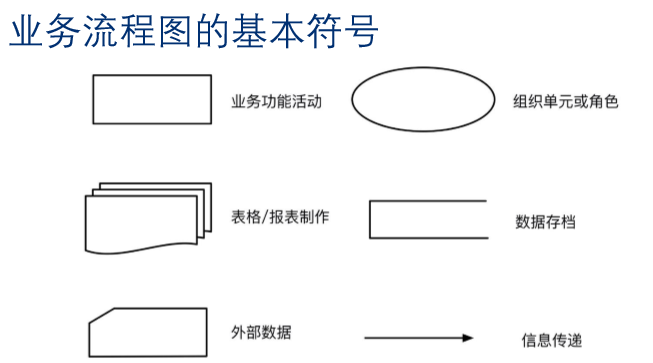

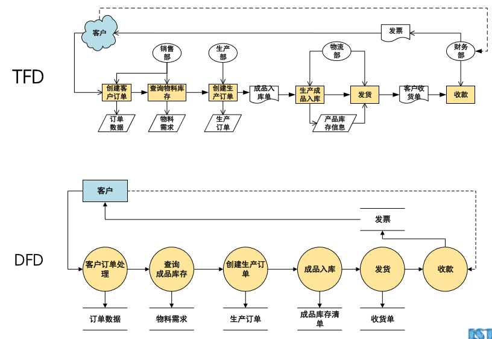

## 2.3 组织模型建模
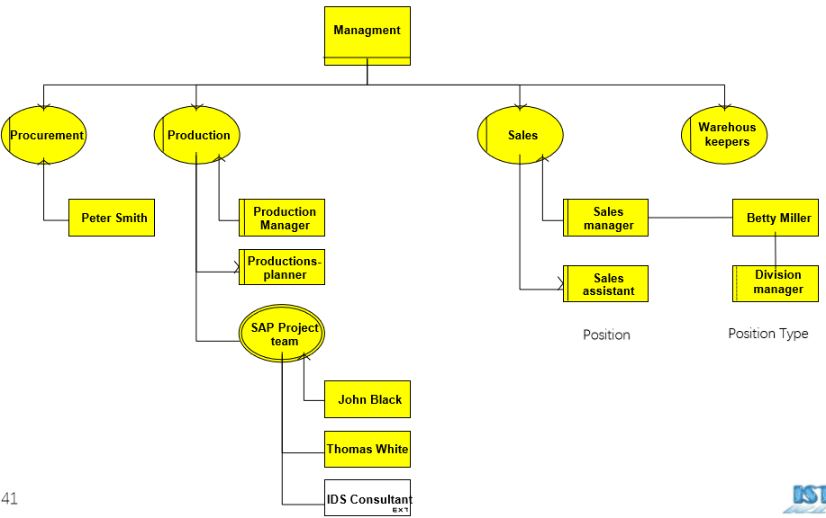
- Organizational units
- Position
- Persons
- Person Types
- Group

### SAP R/3 系统里的组织结构
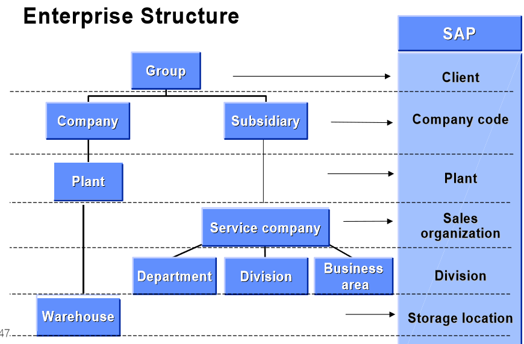

### 企业结构趋势
- 扁平化
- 网络化
- 无边界化
- 多元化
- 柔性化
- 虚拟化

## 3 基于状态的过程建模方法

### 3.1 离散时间动态系统 DEDS
- 系统状态通常只取有限个离散值
- 事件驱动状态演化
- 特点
    - 动态性
    - 复杂性
    - 随机性
    - 层次性
    - 计算复杂性
- 3种理论框架的模型
    - 逻辑层次模型
        - 有限自动机、Petri网
    - 时间层次模型
        - 双子代数、网络演算
    - 统计性能层次模型
        - 排队论（马尔可夫性）

### (Important)3.2 Petri Net 理论
- 用途
    - 系统仿真
    - 数字分析
    - 系统性能描述
    - 系统控制
    - 转化为其他DEDS模型
- 特点
    - 简化细节，易于理解
    - 精确描述系统中有关条件的依赖关系和不依赖关系
    - 方便建模及仿真
    - 适于描述并发和冲突
- 可视化图形描述被形式化数学方法支持
- 结构元素
    - 库所
    - 转移
    - 连接
    - Token
- 规则
    - 连接是有方向的，其上可以标出权重
    - 两个库所或转移之间不允许有边，且不应该有孤立节点
    - 库所可以拥有任意数量的托肯

- 可达图
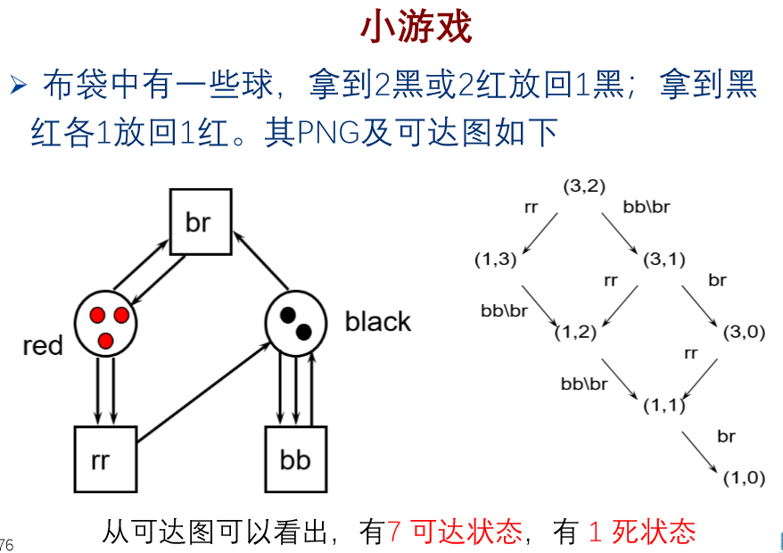

- Petri 网定义为五元组 (库所，转移，输入函数，输出函 数，初始状态)。任何图都可以映射到这样一个五元组上 ∑ = ( P ， T ，F ， K ， M0 )

- 关联矩阵
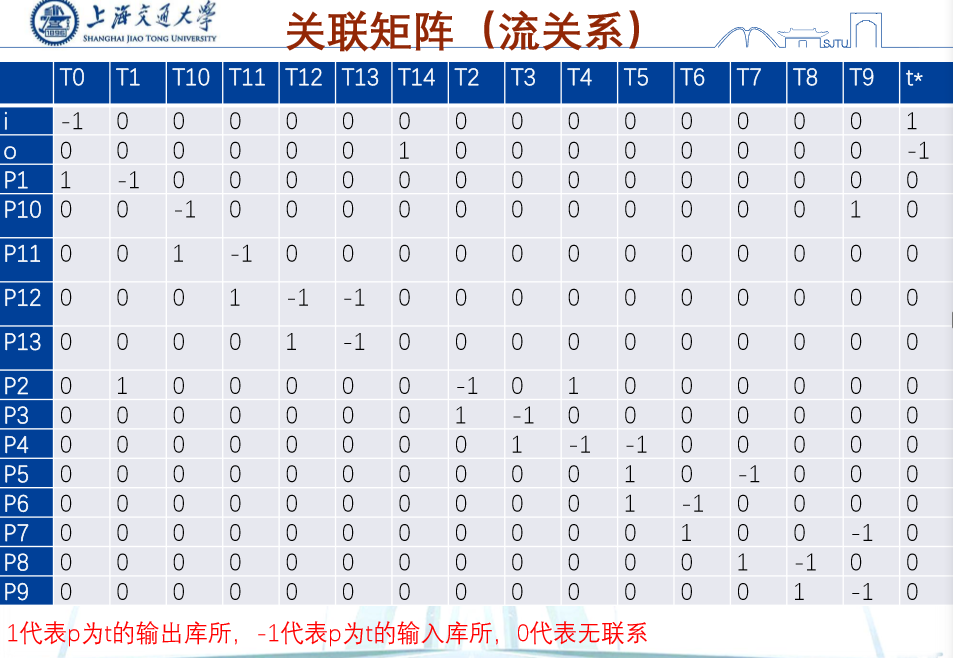

### 3.3 高阶 Petri Net
- 经典 Petri Net 缺点
    - 没有测试库所种零 Token 的能力
    - 模型容易变得很庞大
    - 不能反映时间方面的内容
    - 不支持构造大规模模型，如自顶向下，或自底向上
- 高阶 Petri Net 拓展
    - Token 着色：**颜色**拓展
        - 颜色代表 Token 建模对象的具体特征
    - 时间：**时间**拓展
        - 每个 Token 都有一个时间戳，转移决定生产出的 Token 的延迟。增加时序逻辑的定义
    - 层次化： 对复杂的Petri网**添加结构信息**的方法
        - 构造一个与分层 DFD 类似的复杂建模机制

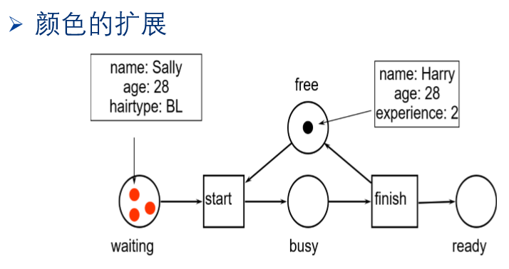
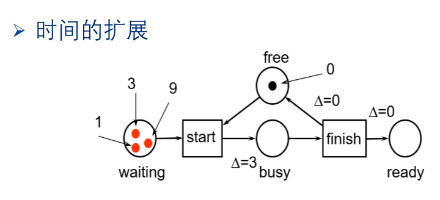
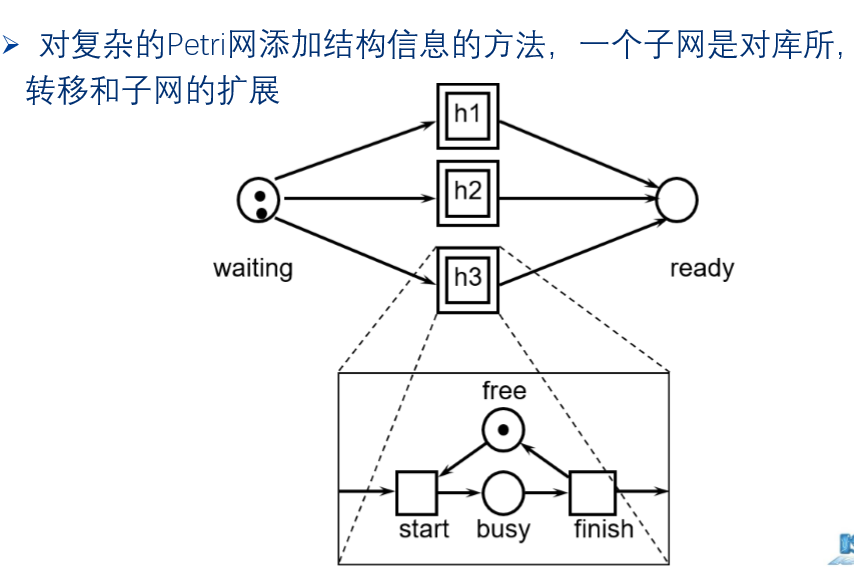

## （Important）4 基于消息事件的过程建模方法
- EPC Event-driven Process Chain

### 4.1 基于事件的过程建模方法
- 元素
    - 事件
        - 描述业务相关的信息对象的状态
    - 功能
        - 任务、操作或活动
    - 逻辑连接符号
    - 组织单元
        - 员工、部门
    - 信息
        - 输入输出数据
- 特点
    - 适合业务人员建模
    - 缩减复杂性
    - 快速映射
        - 程序实现 Function 即可

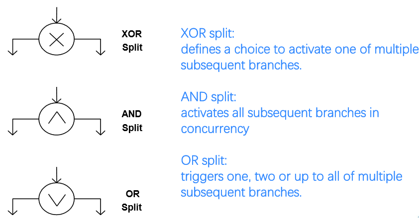
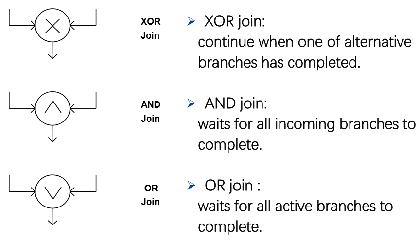

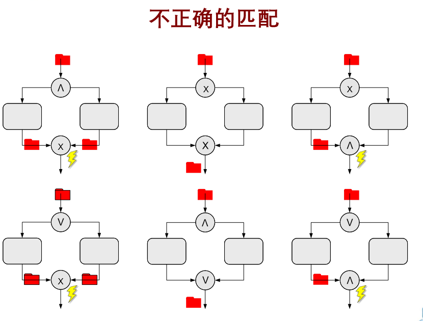
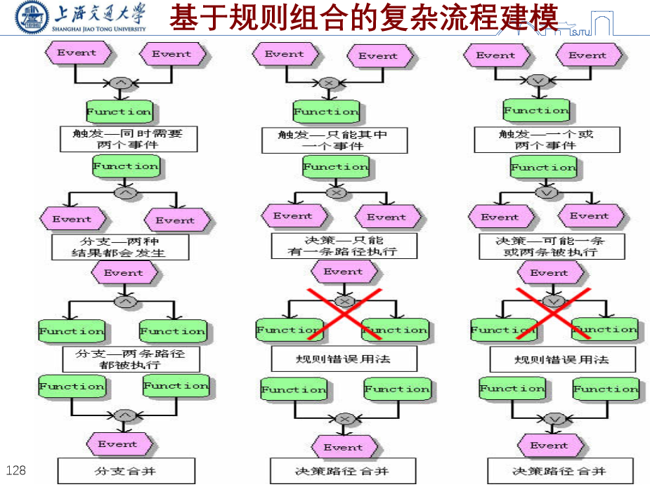

- 每一个模型必须至少包含一个开始事件和一个结束事件。
- 功能与事件交替着出现。
- 事件和功能永远只有一个输入和一个输出连接。
- 流程路径使用规则进行分离与合并。
- 事件是静态的，无法决定决策，决策必须是由功能作出，不 要在事件后使用带有决策的规则连接。

### 4.3 ARIS 建模
- 4 个视图
    - 功能视图
    - 数据视图
    - 组织视图
    - 控制视图

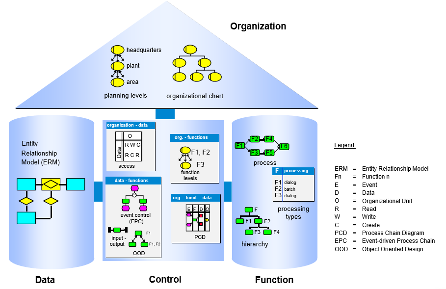

#### 价值增值链图
- 描述直接给企业带来价值增值的过程

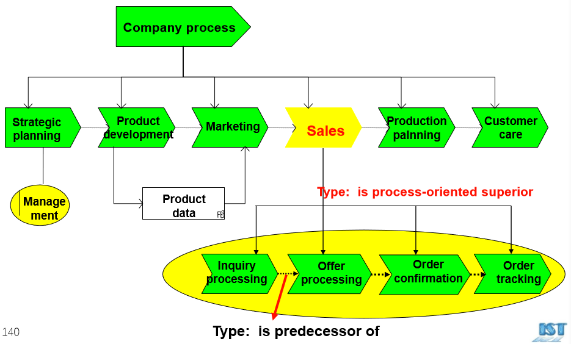

其他图略

## 5 小结
- 以流程为核心，可以建立基于任务、数据、事件、 状态等四种建模方法，也对应着执行流、数据流、 事件流、以及状态转移等建模方法。 
- 基于任务的流程建模方面，其核心是时序下的任务 执行过程；
- 基于数据的过程建模方法，其核心是信息处理过程；
- 基于事件的流程建模方法，其核心是基于消息的信 息交换过程； 
- 基于状态的过程建模方法较为抽象，适用于复杂并 发的应用场合

# （Important）lec 5
## 1 面向流程执行的工作流建模
- 三部分
    - 流程定义
    - 资源管理
    - 资源分配

### 工作流建模概念
- 实现流程的组织管理和流程优化
- 元素
    - 流程模型
    - 案例 （对应库所）
    - 任务 （对应转移）
    - 路由
    - 触发器

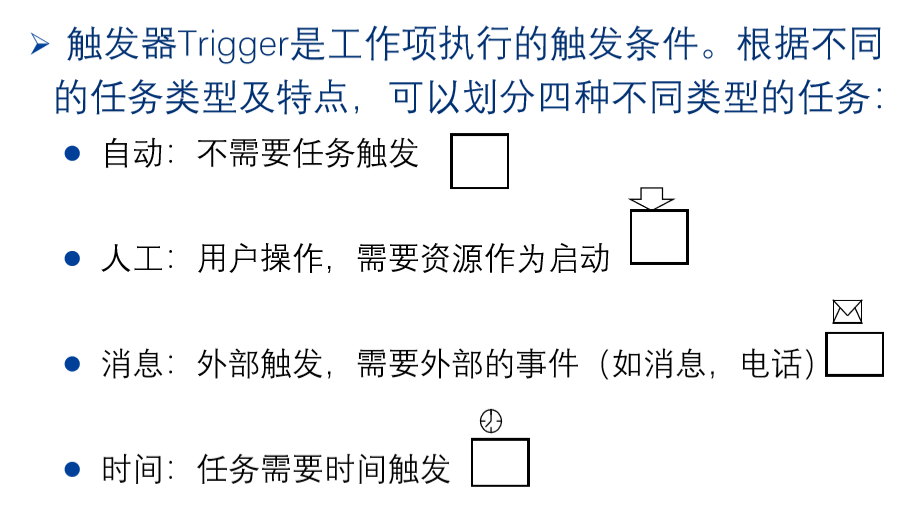

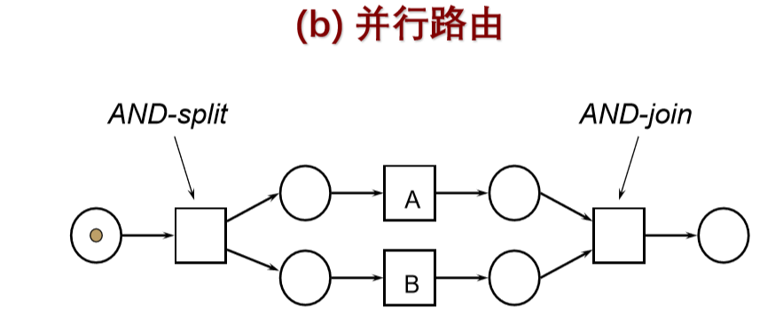

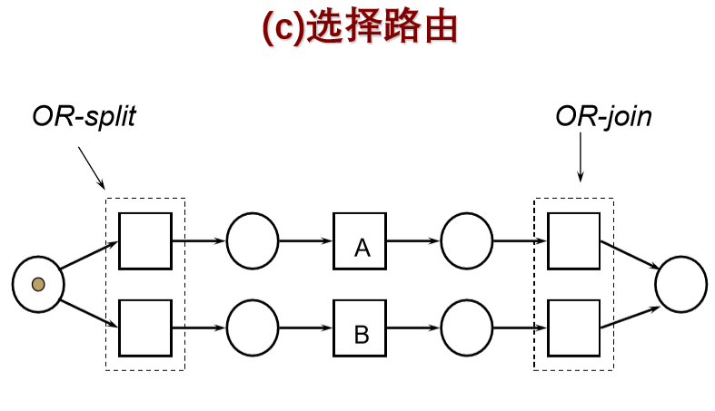

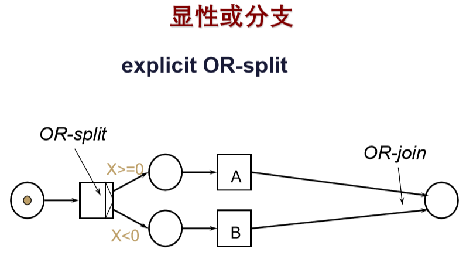

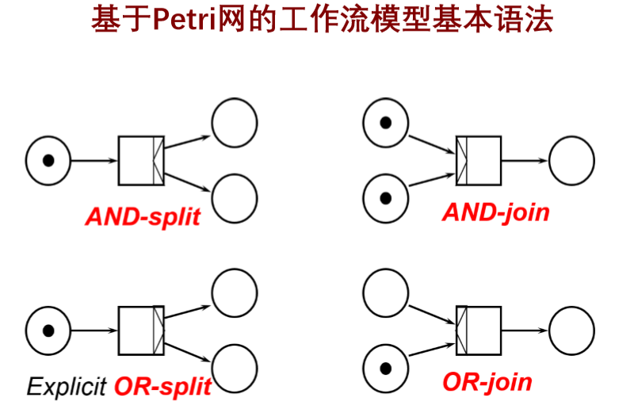

### 1.4 资源分配
- 资源分配包括
    - 基本策略
    - 推拉模式选择
    - 排队原则去顶
    - 资源选择策略
- 人力资源分类
    - 角色模型
    - 组织模型
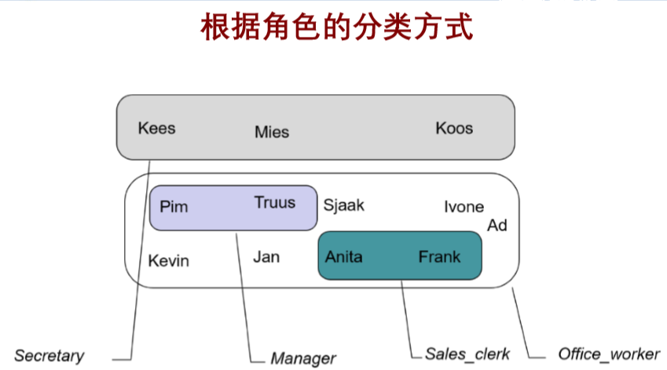
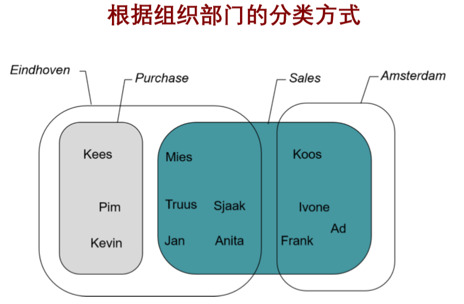

#### 1.4.1 基本策略
- 给工作项分配资源

#### 1.4.2 资源分配的推拉模式
- “推式驱动” ：工作流引擎把工作项和资源进行匹配。通过预设定的条件，工作流引擎能够选择每个工作项由哪个资源执行，资源本身不能做出选择。
- “拉式驱动” ：资源把工作项和自身进行匹配。资源考察 它能够执行的工作项，并从中选择一个。

#### 1.4.3 资源分配的排队原则
- 先进先出 FIFO
- 后进先出 LIFO
- 最短处理时间 SPT
- 最短剩余处理时间 SRPT
- 最早截止期限 EDD

#### 1.4.4 资源选择策略
- 如果一个工作项可以被多个资源执行
    - 让资源发挥自己的专长
    - 让一个资源连续做类似任务
    - 预留弹性资源

## 2 业务流程的定性分析

- 流程检测
    - 死锁检测
    - 活锁检测
    - 确定性检测
    - 无终止检测
    - 可达性检测
    - 线性时序逻辑检测

- 可达性分析
    - 可达图
- 合理性分析
    - 没有输入输出条件
    - 死任务：永远不能被执行
    - 死锁
    - 活锁
    - end 之后仍有活动执行
    - 案例完成后定义的过程仍存在标记

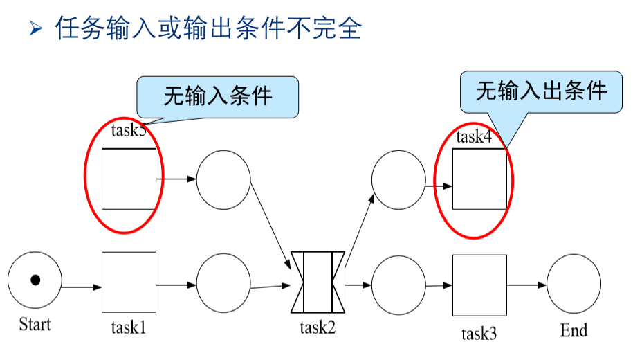

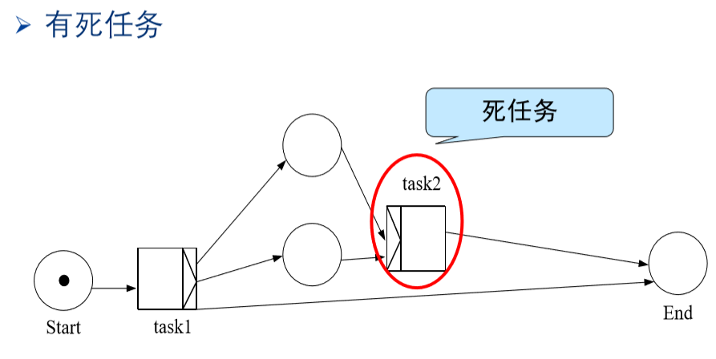

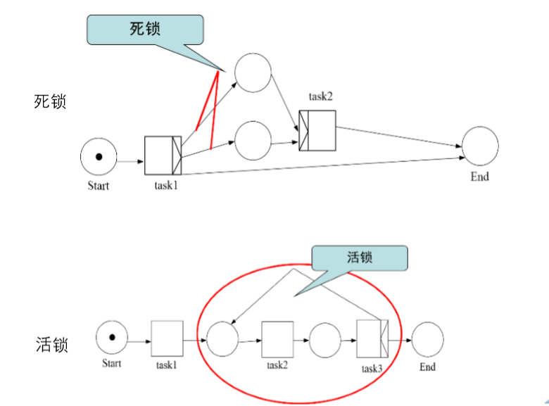

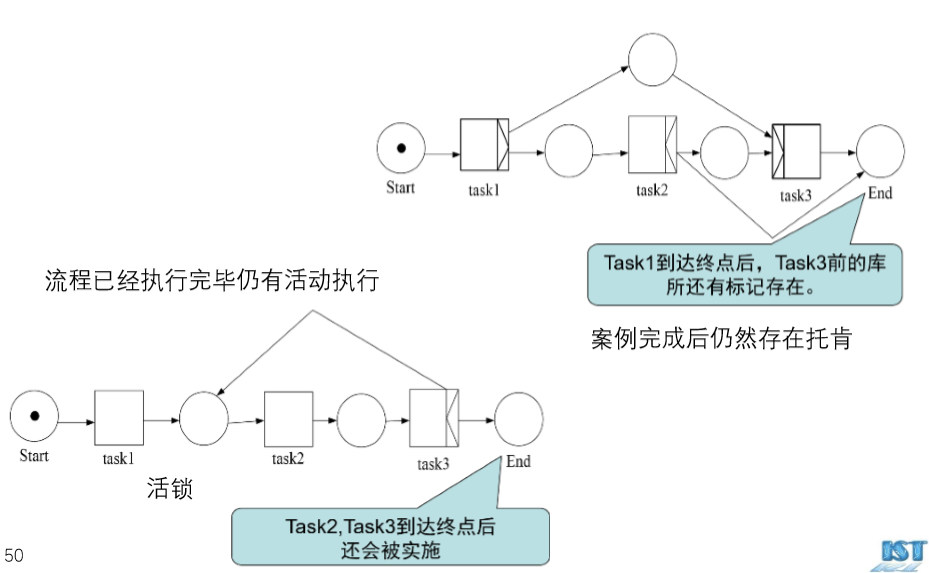

## 3 业务流程的定量分析
### 3.1 流程的性能分析基础
- 性能分析主要有以下方法
    - 马尔可夫分析方法
    - 排队论
    - 计算机仿真方法

- 马尔可夫分析方法
    - 马尔可夫链
    - 增加了转移概率的可达图
    - 缺点
        - 并不是所有性能都能被分析出来
        - 复杂耗时
- 排队论
    - 等待时间
    - 完成时间
    - 资源利用率等
    - 缺点
        - 排队论中很多假设对工作流流程并不合适，特别在并行路由存在的情况下，不能直接应用
- 计算机仿真
    - 跟踪可达图中的路径，基于一定概率进行路径选择
    - 可视化容易为没有数学背景的人接受理解
    - 缺点
        - 模型建立、分析耗时
        - 仿真结果深入处理需要概统知识
    
### 3.2 排队论
- 输入
    - 顾客总数
        - 无限或有限
    - 顾客到达的形式
        - 单个或成批
    - 顾客流的概率分布
- 排队规则
    - 有限排队
    - 无限排队
- 排队规则
    - 等待制
        - 先到先服务 FCFS
        - 后到先服务 LCFS
        - 随即服务 SIRO
        - 有优先权服务 PR
    - 损失制
        - 顾客不愿等待而离开系统
    - 混合制
        - 队长有限
        - 等待时间有限
        - 逗留时间（等待时间+服务时间）有限
- 服务台
    - 服务机构数量及构成形式
    - 服务方式
    - 服务事件分布
#### 排队论的 Kendall 表示
- A/S/m/B/K/SD
    - A：顾客到达的时间间隔概率分布
        - M 泊松分布
        - D 定长
        - E_k K阶 Erlang 分布
        - G 相互独立的随机分布
    - S：服务时间分布
    - m：服务台个数
    - B：系统中顾客容量限额
        - 默认∞
    - K：顾客源限额
        - 默认∞
    - SD：服务规则
        - 默认 FCFS

### M/M/1
- 设单位时间内有 λ 个顾客到达。服务台单位时间内能够服务 μ 个顾客
- 该服务台的利用率 ρ = λ / μ
- 流程当中的平均顾客数（平均队列长度）为 L = ρ /(1-ρ)
- 平均排队时间 W = L / μ
- 服务台服务一个顾客的平均时间为 1/μ
- 平均逗留时间 S = W + 1/μ

### 3.3 流程优化方法
- 外部性能指标（面向案例）
    - 平均完成时间
- 内部性能指标（面向资源）
    - 资源利用率

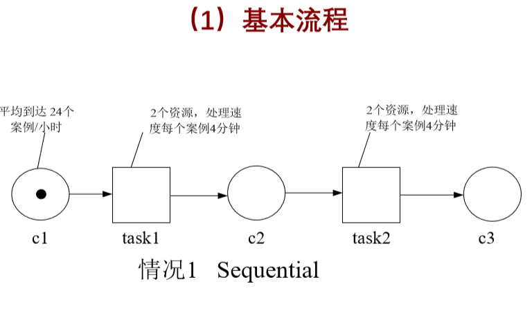
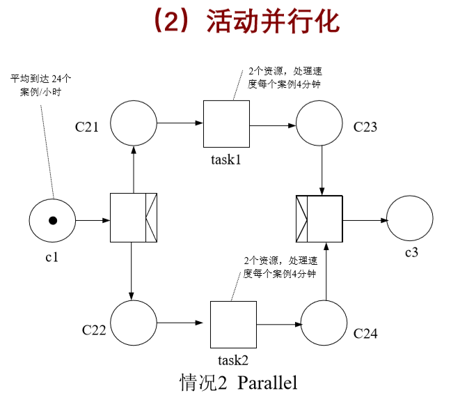
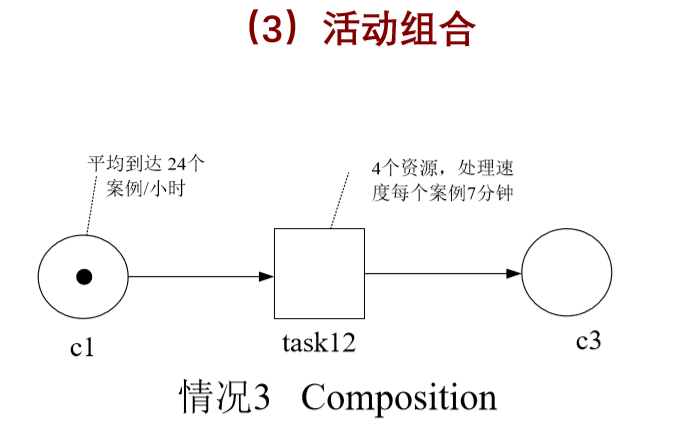
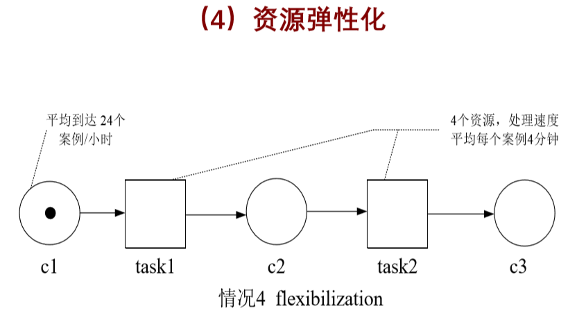
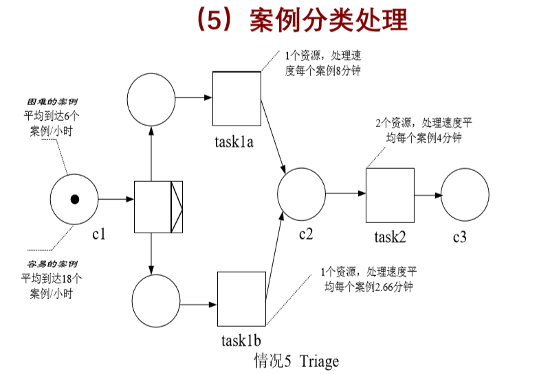
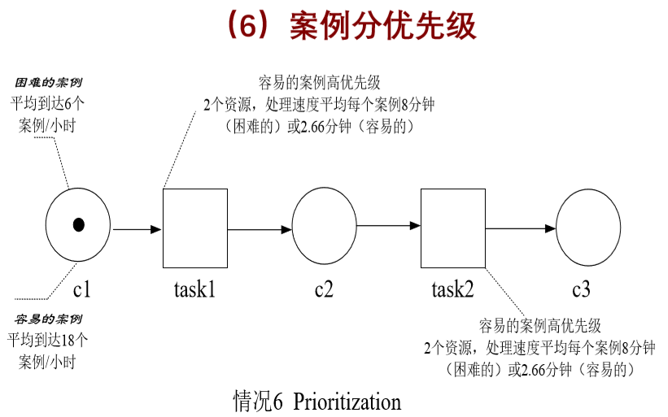

- 尽可能并行
- 提高弹性
- 按照处理时间顺序处理

### 3.4 能力规划
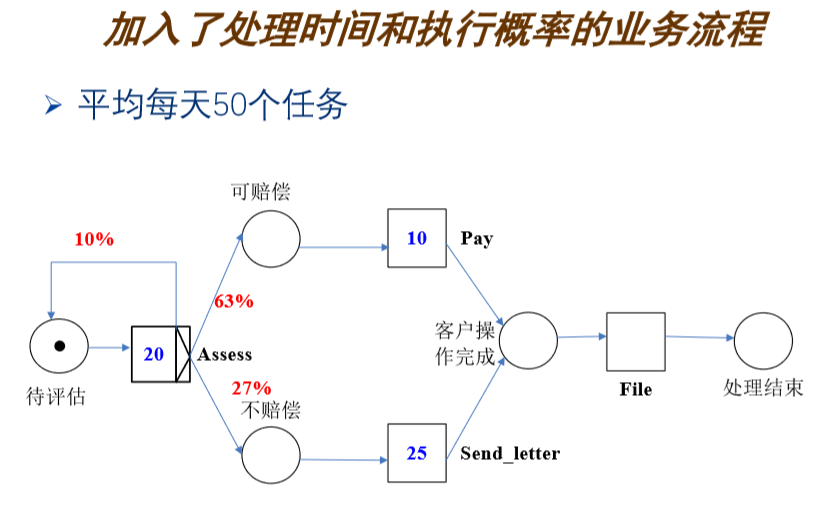

需要设置多少岗位，各岗位需求数量如何？

这里 ppt 漏了一个关键的信息！！！！

每天的工作时间是 8 小时，480 分钟！！！

根据概率计算得到表一

---------------------
| 任务 | 每天平均个数 | 平均处理时间 | 每天总共需要的时间 |
|-----|-------------|------------|---------------|
| Assess | 56 | 20 | 1111 |
| Pay | 35 | 10 | 350 |
| Send-letter | 15 | 25 | 375 |
| File | 50 | 0 | 0 |

- 以 Assess 为例计算：
    - 有 10% 会重复执行
    - 一天共 50 + 50 * 10% + 50 * 10% * 10% + ... ≈ 56 个 Assess 任务
    - 每个任务被执行 (1 + 0.1 + 0.1 * 0.1 + ...) ≈ 1.111 次
    - 总共执行的时间为 1.111 * 20 * 50 = 1111
    - （其实时间就是 56 * 20，只不过有误差而已）

若规定表二

---------------------------
| 任务 | 角色 | 组织单元 |
|------|-----|----------|
| Assess | Assessor | Compliant |
| Pay | Employee | Finances |
| Send-letter | Employee | Compliant |

资源类的能力需求表三

--------------------------------
| 资源类 | 每天总共需要的时间 | 能力在80%时的资源个数 | 能力在60%时的资源个数 |
|------|---------|---------|---------|
| Employee | 725 | 1.89 | 2.52 |
| Assessor | 1111 | 2.90 | 3.86 |
| Complaints | 1486 | 3.87 | 5.15 |
| Finances | 350 | 0.91 | 1.22 |

- 以 Employee 为例计算
    - 每天总共需要的时间，根据表一&表二计算得到 350+375=725 分钟
    - 假设总共有 x 人
    - 能力 80%，即每天有 0.8x 个人工作 480 分钟
    - 0.8x * 480 = 725
    - x = 1.89

## 4 业务流程执行标准
### 4.1 业务流程管理
- 以流程为核心
- 三大标准
    - XPDL（WfMC）
    - BPEL/BPEL4WS
    - BPMN/BPDM

### 4.2 XPDL
- 保证流程定义在两个设计工具之间进行交换，保证流程执行语义的一致性

### 4.3 BPEL/BPEL4WS
- 除了**时序与逻辑关系**
- 还可以表示业务伙伴间的**依赖关系**
- 例外处理机制（错误处理）
- 补偿机制
- 可重用性
- SOA
- 向编程发展

### 4.4 BPMN
- 提供容易被业务用户理解的描述语言

### 4.5 业务流程标准比较

-------------------------
| 流程标准 | XPDL | BPEL | BPMN |
|---------|-------|-----|-------|
| 维护组织 | WfMC | OASIS | OMG |
| 核心目标 |数据共享及交换 | 服务自动化编 排 | 业务流程设计到 | 流程开发 | 
| 针对用户 | 运维者 | IT编程人员 | 业务人员 |
| 特点 | 缺少状态 | 无人工活动 | 多种交互方式 |
| 适用范围 | 简单的活动关系， 如办公审批流程 | 程序的互操作实现 | 业务定义到组件映射 
| 标准特点 | 大而全 | 可读性较弱 | 定义完备 |
| 针对生命周期阶段 | 设计到执行期 | 动态执行期 | 执行期 |

## 5 小结

从流程的执行出发，阐述了流程的分析和优化的主 要方法，包括马尔科夫链、排队论和仿真方法。 

阐述了工作流执行的流程定义、资源分类以及资源 任务分配等方面。 

重点从可达性、合理性方面对业务流程的定性分析 进行了阐述。 

基于排队论阐述了流程的定量分析方法，以及初步 的排队论理论方法。 

讨论了三种流程执行标准的主要特点和比较